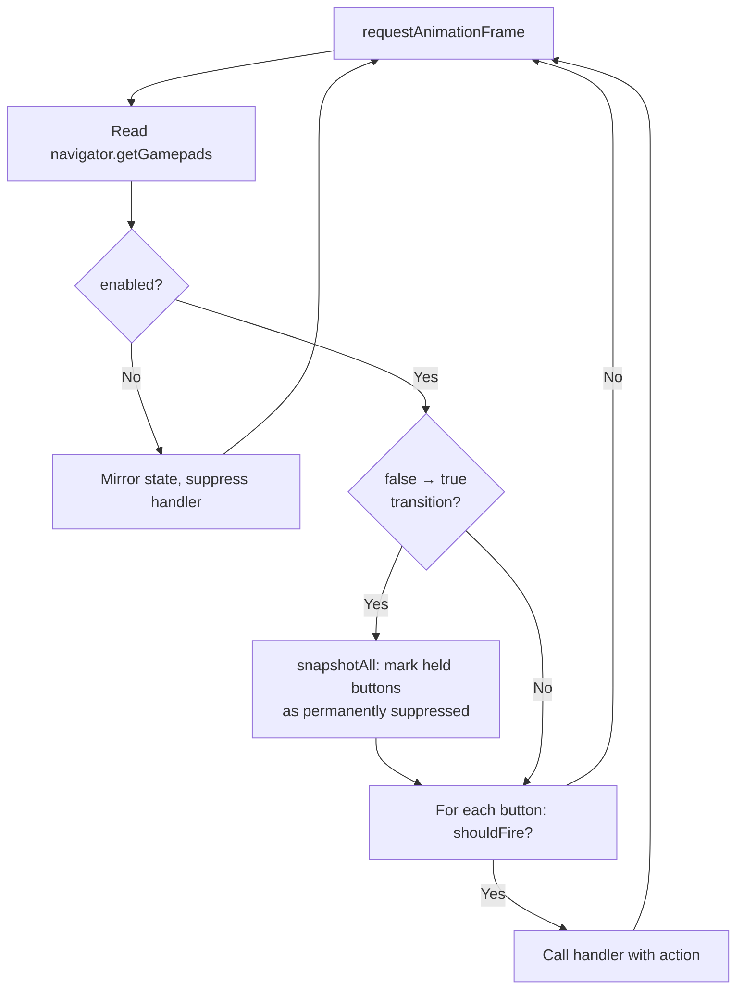
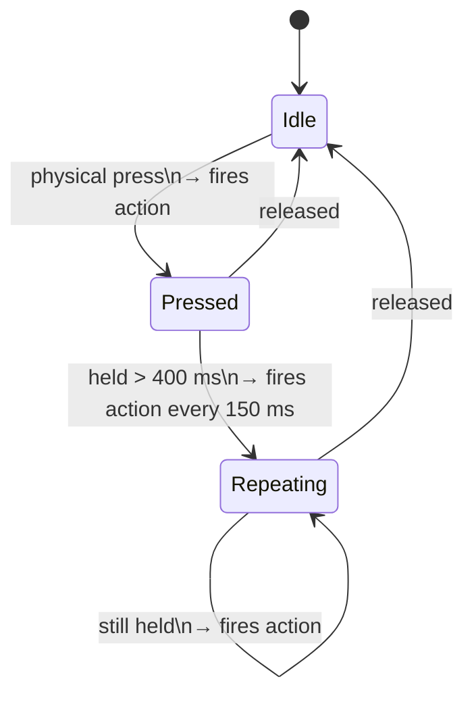
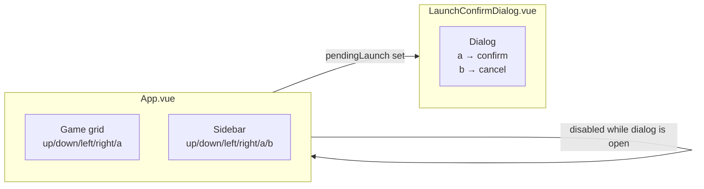

# Gamepad Support

Controller input is handled entirely on the frontend via the browser Gamepad API, polled inside a `requestAnimationFrame` loop in `src/composables/useGamepad.ts`.

## Button mapping

The default profile (`STANDARD_PROFILE`) follows the W3C standard layout, compatible with Xbox One/Series and PS4/PS5 controllers.

| Action  | Xbox        | PlayStation |
|---------|-------------|-------------|
| `a`     | A           | Cross       |
| `b`     | B           | Circle      |
| `lb`    | LB          | L1          |
| `rb`    | RB          | R1          |
| `up`    | D-pad up    | D-pad up    |
| `down`  | D-pad down  | D-pad down  |
| `left`  | D-pad left  | D-pad left  |
| `right` | D-pad right | D-pad right |

The left stick is also mapped to the four directional actions using a dead-zone threshold of `0.5`.

## How polling works

Every frame, `useGamepad` reads the current gamepad state and decides whether to fire an action.



## Repeat-fire

Holding a button fires the action repeatedly, like holding a key on a keyboard.

| Phase          | Timing                              |
|----------------|-------------------------------------|
| First press    | Fires immediately                   |
| Initial delay  | 400 ms before the first repeat      |
| Repeat rate    | Every 150 ms while held             |

This makes D-pad navigation feel fast and natural when scrolling through the game grid.

## Button state machine



## Ghost press prevention

When `useGamepad` is re-enabled (e.g. after a dialog closes), any button still physically held must **not** fire. Without this, closing a dialog with A while still holding A would immediately re-trigger the underlying screen.

On every `disabled → enabled` transition, `snapshotAll` marks currently-held buttons with `pressedAt: Infinity`. Because the repeat-fire condition checks `now - pressedAt > repeatDelay`, this value can never be satisfied, so the button is silently ignored until it is fully released and freshly pressed.

The same snapshot runs in `onMounted` to prevent ghost presses from a button that was held before the component was even created.

## Using `useGamepad` in a component

```ts
useGamepad((action) => {
  if (action === "a") confirm();
  if (action === "b") cancel();
});
```

To suppress input while a modal is open, pass a reactive `enabled` ref:

```ts
const active = computed(() => !modalOpen.value);

useGamepad((action) => { /* ... */ }, { enabled: active });
```

When `enabled` is `false`, button state is still tracked internally so the ghost press protection works correctly the moment `enabled` flips back to `true`.

## Component responsibilities



`App.vue` owns a single `useGamepad` instance gated by `gamepadEnabled`. `LaunchConfirmDialog` owns its own ungated instance. Only one of them is effectively active at any given time.
